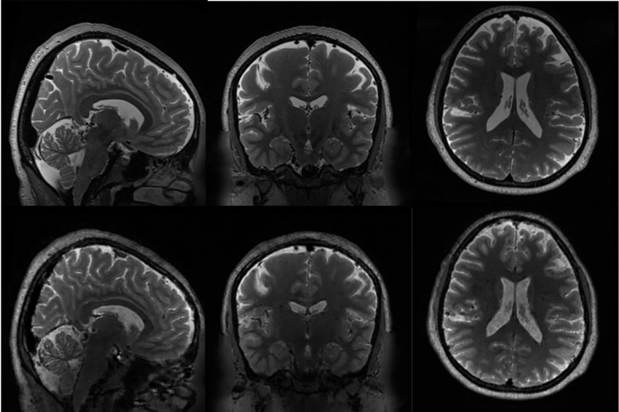
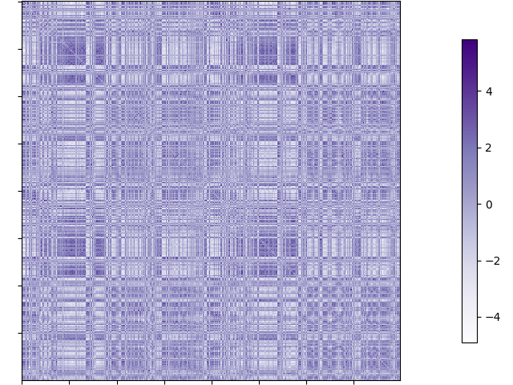
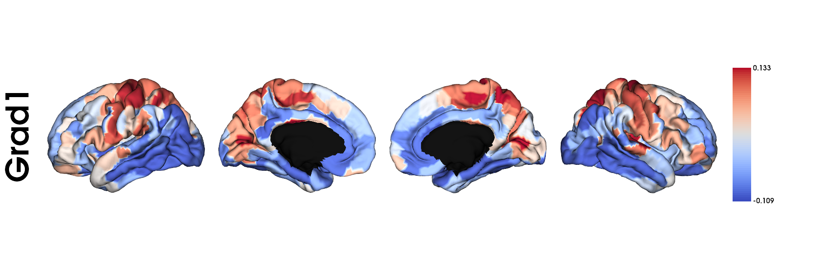
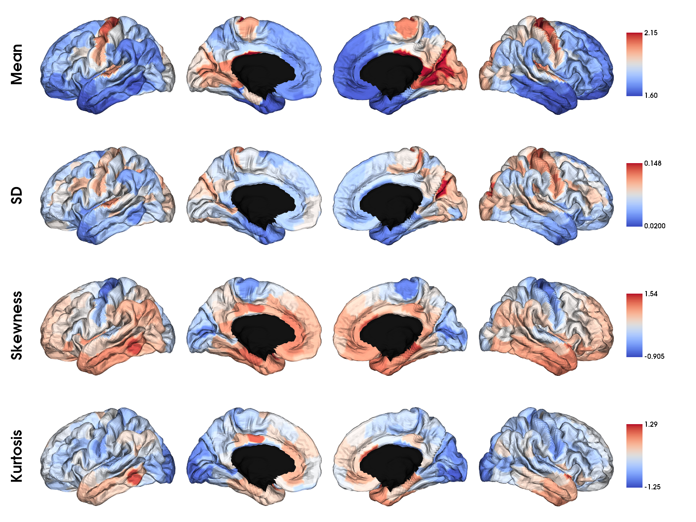

------------
MAIN OUTPUTS
------------

Main output files
=================

Output data structure
---------------------

.. code-block::

   output_dir
   ├── 105923                                   # Subject ID
   │   ├── T2w.nii.gz                           # Synthesized T2-weighted MRI
   │   ├── myelin.nii.gz                        # Synthesized microstructure-sensitive proxy
   │   ├── schaefer-100_MPC_matrix.txt          # MPC matrix with schaefer-100 atlas
   │   ├── schaefer-200_MPC_matrix.txt          # MPC matrix with schaefer-200 atlas
   │   ├── schaefer-300_MPC_matrix.txt          # MPC matrix with schaefer-300 atlas
   │   ├── schaefer-400_MPC_matrix.txt          # MPC matrix with schaefer-400 atlas
   │   ├── schaefer-500_MPC_matrix.txt          # MPC matrix with schaefer-500 atlas
   │   ├── schaefer-600_MPC_matrix.txt          # MPC matrix with schaefer-600 atlas
   │   ├── schaefer-700_MPC_matrix.txt          # MPC matrix with schaefer-700 atlas
   │   ├── schaefer-800_MPC_matrix.txt          # MPC matrix with schaefer-800 atlas
   │   ├── schaefer-900_MPC_matrix.txt          # MPC matrix with schaefer-900 atlas
   │   ├── schaefer-1000_MPC_matrix.txt         # MPC matrix with schaefer-1000 atlas
   │   ├── vosdewael-100_MPC_matrix.txt         # MPC matrix with vosdewael-100 atlas
   │   ├── vosdewael-200_MPC_matrix.txt         # MPC matrix with vosdewael-200 atlas
   │   ├── vosdewael-300_MPC_matrix.txt         # MPC matrix with vosdewael-300 atlas
   │   ├── vosdewael-400_MPC_matrix.txt         # MPC matrix with vosdewael-400 atlas
   │   ├── aparc_MPC_matrix.txt                 # MPC matrix with aparc atlas
   │   ├── aparc-a2009s_MPC_matrix.txt          # MPC matrix with aparc-a2009s atlas
   │   ├── economo_MPC_matrix.txt               # MPC matrix with economo atlas
   │   ├── glasser-360_MPC_matrix.txt           # MPC matrix with glasser-360 atlas
   │   ├── schaefer-100_MPC_gradients.txt       # Microstructural gradient with schaefer-100 atlas
   │   ├── schaefer-200_MPC_gradients.txt       # Microstructural gradient with schaefer-200 atlas
   │   ├── schaefer-300_MPC_gradients.txt       # Microstructural gradient with schaefer-300 atlas
   │   ├── schaefer-400_MPC_gradients.txt       # Microstructural gradient with schaefer-400 atlas
   │   ├── schaefer-500_MPC_gradients.txt       # Microstructural gradient with schaefer-500 atlas
   │   ├── schaefer-600_MPC_gradients.txt       # Microstructural gradient with schaefer-600 atlas
   │   ├── schaefer-700_MPC_gradients.txt       # Microstructural gradient with schaefer-700 atlas
   │   ├── schaefer-800_MPC_gradients.txt       # Microstructural gradient with schaefer-800 atlas
   │   ├── schaefer-900_MPC_gradients.txt       # Microstructural gradient with schaefer-900 atlas
   │   ├── schaefer-1000_MPC_gradients.txt      # Microstructural gradient with schaefer-1000 atlas
   │   ├── vosdewael-100_MPC_gradients.txt      # Microstructural gradient with vosdewael-100 atlas
   │   ├── vosdewael-200_MPC_gradients.txt      # Microstructural gradient with vosdewael-200 atlas
   │   ├── vosdewael-300_MPC_gradients.txt      # Microstructural gradient with vosdewael-300 atlas
   │   ├── vosdewael-400_MPC_gradients.txt      # Microstructural gradient with vosdewael-400 atlas
   │   ├── aparc_MPC_gradients.txt              # Microstructural gradient with aparc atlas
   │   ├── aparc-a2009s_MPC_gradients.txt       # Microstructural gradient with aparc-a2009s atlas
   │   ├── economo_MPC_gradients.txt            # Microstructural gradient with economo atlas
   │   ├── glasser-360_MPC_gradients.txt        # Microstructural gradient with glasser-360 atlas
   │   ├── schaefer-100_MPC_moment.txt          # Microstructural moment with schaefer-100 atlas
   │   ├── schaefer-200_MPC_moment.txt          # Microstructural momnet with schaefer-200 atlas
   │   ├── schaefer-300_MPC_moment.txt          # Microstructural momnet with schaefer-300 atlas
   │   ├── schaefer-400_MPC_moment.txt          # Microstructural momnet with schaefer-400 atlas
   │   ├── schaefer-500_MPC_moment.txt          # Microstructural momnet with schaefer-500 atlas
   │   ├── schaefer-600_MPC_moment.txt          # Microstructural momnet with schaefer-600 atlas
   │   ├── schaefer-700_MPC_moment.txt          # Microstructural momnet with schaefer-700 atlas
   │   ├── schaefer-800_MPC_moment.txt          # Microstructural momnet with schaefer-800 atlas
   │   ├── schaefer-900_MPC_moment.txt          # Microstructural momnet with schaefer-900 atlas
   │   ├── schaefer-1000_MPC_moment.txt         # Microstructural momnet with schaefer-1000 atlas
   │   ├── vosdewael-100_MPC_moment.txt         # Microstructural momnet with vosdewael-100 atlas
   │   ├── vosdewael-200_MPC_moment.txt         # Microstructural momnet with vosdewael-200 atlas
   │   ├── vosdewael-300_MPC_moment.txt         # Microstructural momnet with vosdewael-300 atlas
   │   ├── vosdewael-400_MPC_moment.txt         # Microstructural momnet with vosdewael-400 atlas
   │   ├── aparc_MPC_moment.txt                 # Microstructural momnet with aparc atlas
   │   ├── aparc-a2009s_MPC_moment.txt          # Microstructural momnet with aparc-a2009s atlas
   │   ├── economo_MPC_moment.txt               # Microstructural momnet with economo atlas
   │   └── glasser-360_MPC_moment.txt           # Microstructural momnet with glasser-360 atlas
   └── ...
   
Synthesized T2-weighted MRI
---------------------------

- Actual T2w (top) / Synthesized T2w (bottom)

|

Synthesized MPC matrix 
---------------------------------------------------

.. code-block::

   import numpy as np
   from nilearn import plotting

   # load matrix
   matrix = np.loadtxt("~/output_dir/sub/schaefer-400_MPC_matrix.txt")
   print(matrix.shape)

>>> (400, 400)

MPC matrix visualization.

.. code-block::
   
   plotting.plot_matrix(matrix, cmap='Purples')

|

Synthesized microstructural gradient
---------------------------------------------------

We calculated gradients using diffusion embedding and normalized angle kernel with 0.9 sparsity. More details in */GAN-MAT/functions/preprocessing.py*

.. code-block::

   import numpy as np
   grads_400 = np.loadtxt("~/output_dir/sub/schaefer-400_MPC_gradients.txt")
   print(grads_400.shape)

>>> (400, 10)

.. code-block::

   import nibabel as nib
   from brainspace.datasets import load_fsa5
   from brainspace.plotting import plot_hemispheres
   from brainspace.utils.parcellation import map_to_labels

   # Load the fsaverage5 surfaces
   fs5_lh, fs5_rh = load_fsa5()

   # Load annotation file in fsaverage5
   annot_lh_fs5= nib.freesurfer.read_annot("~/GAN-MAT/parcellations/lh.schaefer-400_mics.annot")
   annot_rh_fs5= nib.freesurfer.read_annot("~/GAN-MAT/parcellations/rh.schaefer-400_mics.annot")[0]+200
   annot_rh_fs5 = np.where(annot_rh_fs5==200, 0, annot_rh_fs5)
   labels_fs5 = np.concatenate((annot_lh_fs5[0], annot_rh_fs5), axis=0)

   # Mask of the medial wall on fsaverage5
   mask_fs5 = labels_fs5 != 0

   # Map gradients to original parcels
   grad = [None]
   for i in range(1):
       grad[i] = map_to_labels(-grads_400[:,i], labels_fs5, mask=mask_fs5, fill=np.nan)
   
   # Plot gradients
   plot_hemispheres(fs5_lh, fs5_rh, array_name=grad, size=(1800, 600), cmap='coolwarm',
                color_bar=True, label_text=['Gradient'], zoom=1.2)
                

|

Synthesized microstructural moments
---------------------------------------------------

We provide microstructural moment features(mean, standard deviation, skewness, kurtosis).

.. code-block::

   moments_400 = np.loadtxt("~/output_dir/sub/schaefer-400_MPC_moment.txt")
   print(moments_400.shape)

>>> (4, 400)

.. code-block::

   # Map moments to original parcels
   moments = [None]
   for i in range(4):
       moments[i] = map_to_labels(moments_400[:,i], labels_fs5, mask=mask_fs5, fill=np.nan)
   
   # Plot gradients
   plot_hemispheres(fs5_lh, fs5_rh, array_name=moments, size=(1600, 1200), cmap='coolwarm',
                color_bar=True, label_text=['Mean', "SD", "Skewness", "Kurtosis"], zoom=1.35)

