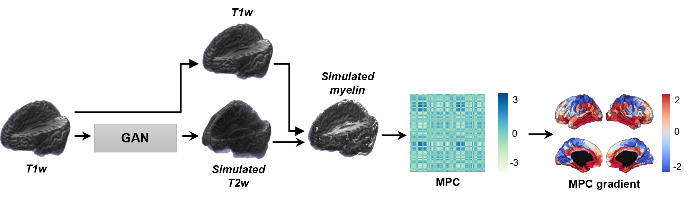

.. GAN-MAT documentation master file, created by
   sphinx-quickstart on Thu Dec 22 04:31:56 2022.
   You can adapt this file completely to your liking, but it should at least
   contain the root `toctree` directive.

Welcome to GAN-MAT
===================================
GAN-MAT: Generative Adversarial Network-based Microstructural profile covariance Analysis Toolbox

GAN-MAT is a comprehensive pipeline to analyze brain microstructure using only the T1-weighted MRI. 

Three main features of GAN-MAT:

**1. T1w to T2w MRI synthesis**

   GAN-MAT synthesizes 3D T2-weighted MRI from 3D T1-weighted MRI using a conditional generative adversarial network (GAN). 

**2. Myelin-sensitive proxy calculation**

   Using the synthesized T2-weighted MRI, GAN-MAT calculates the ratio between T1- and T2-weighted MRI.

**3. Microstructural profile covariance and gradient generation**

   The ready-to-use microstructural profile covariance (MPC) matrix, microstructural gradient, and moment features are computed.

.. toctree::
   :maxdepth: 1
   :caption: Contents

   Table/INSTALLATION
   Table/USAGE NOTES
   Table/MAIN OUTPUTS
   Table/REFERENCES & ACKNOWLEDGMENTS

Core developers
---------------

- **Yeongjun Park**, *MIP Lab - Sungkyunkwan University*
- **Bo-yong Park**, *CAMIN Lab - Inha University*

& the team
---------------

- **Mi Ji Lee**, *Seoul National University Hospital*
- **Seulki Yoo**, *CAMIN Lab - Inha University*
- **Chae Yeon Kim**, *CAMIN Lab - Inha University*
- **Jong Young Namgung**, *CAMIN Lab - Inha University*
- **Yunseo Park**, *CAMIN Lab - Inha University*
- **Hyunjin Park**, *MIPL - Sungkyunkwan University*
- **Eunjung Lee**, *Poderosa*
- **Yeodong Yun**, *Poderosa*
- **Casey Paquola**, *Multiscale Neuroanatomy Lab - INM-1 at Forschungzentrum Juelich*
- **Boris Bernhardt**, *MICA Lab - Montreal Neurological Institute*

